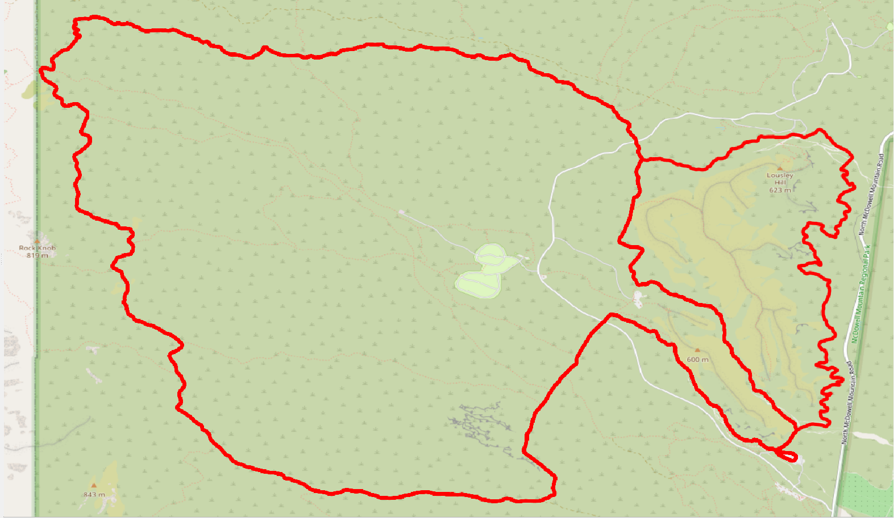
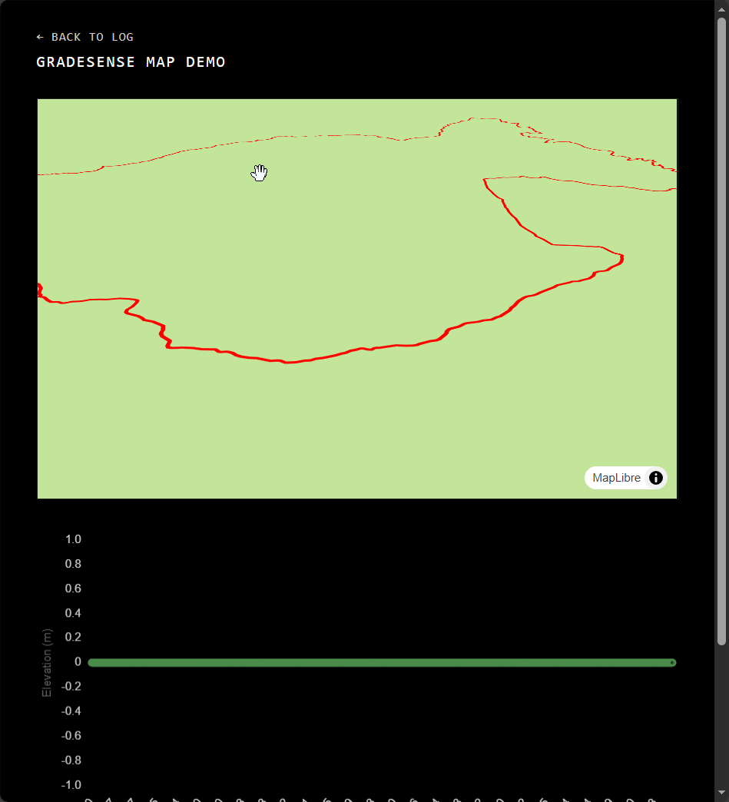

# GIS Pipeline Development

2025-12-30

tags: GradeSense

## TL;DR
- Snapped GPX tracks to OSM trails for accurate alignment.  
- Developed a method to detect start/finish crossings by analyzing distance to a reference point, then split the course into individual laps.  
- Pipeline is conceptually ready for full automation; explored manually first to validate.

## The Long Story

It had been a while since I used QGIS, so I started out a little rusty and lost some time trying to combine layers with different coordinate systems. Once that was sorted, I got a clean line snapped to OSM trails. This alone is a big win for accuracy: the GPX now adheres exactly to the physical trail network, which makes everything downstream much more reliable.

The main challenge was splitting the laps. After snapping, all lap starts looked almost identical, and variations in lap distance meant I couldn't just cut the line every fixed number of miles. The approach I settled on was to analyze the snapped line densely, measuring the distance from every step to a fixed reference at the start/finish. By detecting **local minima under a tight tolerance**, I could identify every crossing of the start/finish line. Finally, I map those crossings back to the original line coordinates to create separate lap segments.

I like this hands-on approach. Messing with the data manually first helps me understand what's happening, so that when I eventually automate the full pipeline—snapping GPX, extracting terrain, splitting laps—it will be straightforward and reliable. Conceptually, the pipeline is now: snap GPX to OSM, identify start/finish crossings by local minima of distance to a reference point, split into laps, and then eventually fold in terrain analysis and 1D elevation profiles. For now, clarity and correctness take priority over automation.

I also started building the web app for the map. The hope is to eventually have a 3D version of the map you can fly through, a 2D version you can use for directions (to download directions .FIT or .GPX files, for example), and a 1D version for elevation, slope, etc. The [GradeSense Map Demo](GradeSenseDemo.html) is live, though it is quite embarassing.   

Here's a snapshot to look back on:

